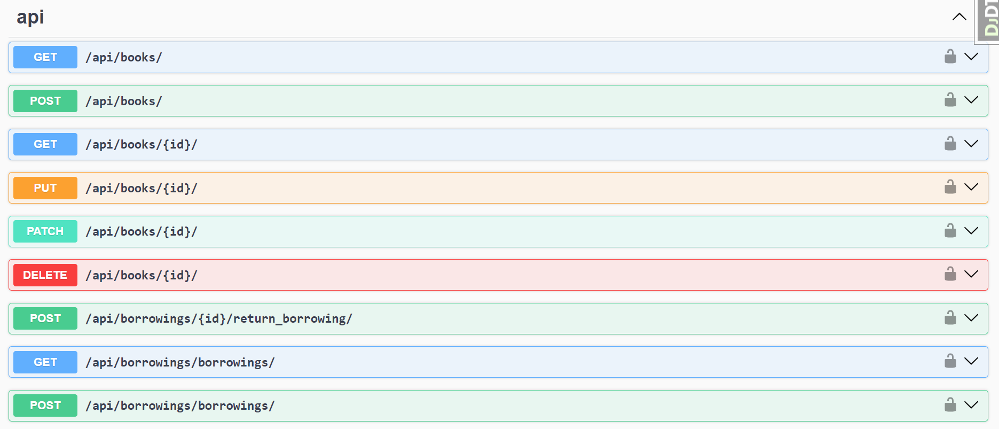
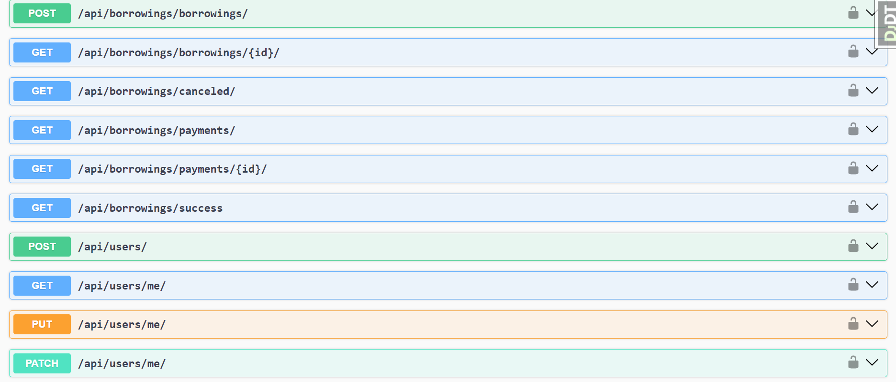
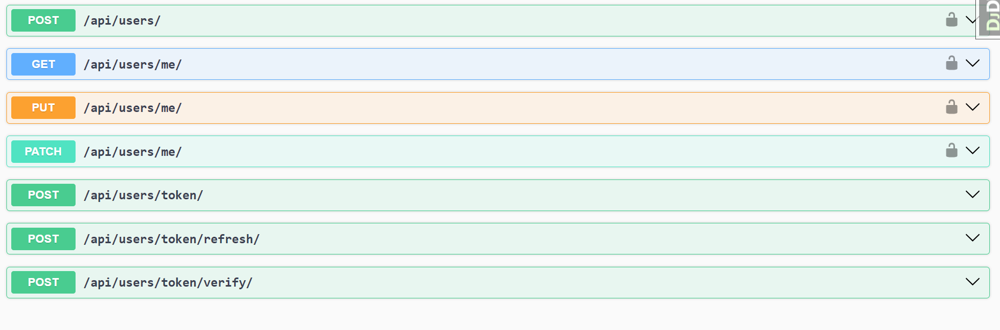

# Library_Service_Project

Django REST Framework API Project 
Project Title: "Library Service Project "

Project Description:

The "Modernization of City Library Management System" project aims to revolutionize our city library's operations by replacing the outdated manual system with a modern digital solution. The current process of tracking books, borrowings, users, and payments is labor-intensive and error-prone, hindering efficient library management.

## Installation

Python 3.10.x must be already installed

```shell
git https://github.com/CeO-PsH/Library_Service_Project.git
cd Library_Service_Project
pythone -m venv venv
source venv//Scripts//activate
pip install -r requirements.txt
env.sanple change .env
pythone manage.py runserver
```
## Features:
**Features of the Modernization of City Library Management System:**

1. **Digital Catalog System:**
   - Implementation of a digital catalog system to efficiently manage the library's book inventory.
   - Allows users to easily search for and reserve specific books.

2. **User Registration and Management:**
   - User registration system for maintaining accurate user records.
   - Enables library staff to manage user information and borrowing history.

3. **Automated Borrowing and Payment:**
   - Streamlined borrowing process for users, with support for both cash and credit card payments.
   - Eliminates manual record-keeping, reducing errors and administrative workload.

4. **Notification System:**
   - Automated reminders for due dates and overdue books.
   - Enhances user accountability and reduces late returns.

5. **Admin Features:**
   - Admin users can filter and view borrowing records, including active and inactive borrowings.
   - Admins can filter borrowers by user ID for efficient management.

6. **Fine Calculation:**
   - Calculates fines for late returns based on the book's daily fee and the actual return date.

7. **Stripe Integration:**
   - Integration with Stripe payment gateway for secure online payments.
   - Users can make payments online for fines or borrowings.

8. **Real-time Updates:**
   - Real-time updates to the library catalog and borrowing status.
   - Users can see the availability of books and the status of their borrowings.

9. **Telegram Notifications:**
   - Sends notifications to a Telegram channel when users borrow or return books and when payments are made.
   - Provides instant updates to library staff.

10. **Pagination:**
    - Pagination of borrowing and payment records for easy navigation and access to historical data.

11. **Success and Cancellation Pages:**
    - Redirects users to a success page after a successful payment.
    - Provides a cancellation message and redirects users to an appropriate page when payments are canceled.

12. **Security and Error Handling:**
    - Implements security measures for payment processing.
    - Provides error handling and logging for troubleshooting.

13. **Scalability:**
    - Designed for scalability, allowing the library to handle a growing number of users and books.

14. **Data Integrity:**
    - Ensures data integrity and accuracy by automating record-keeping processes.

17. **Cost Reduction:**
    - Reduces operational costs associated with manual book tracking and payment handling.

18. **Customization:**
    - Allows for customization and adaptation to the specific needs of the city library.

This modernization project will significantly enhance the efficiency and convenience of the city library, benefiting both patrons and staff.

The project is built using Django and Django REST framework and utilizes the drf-spectacular extension for automated OpenAPI documentation generation. Various libraries and packages are used to simplify web application development.


